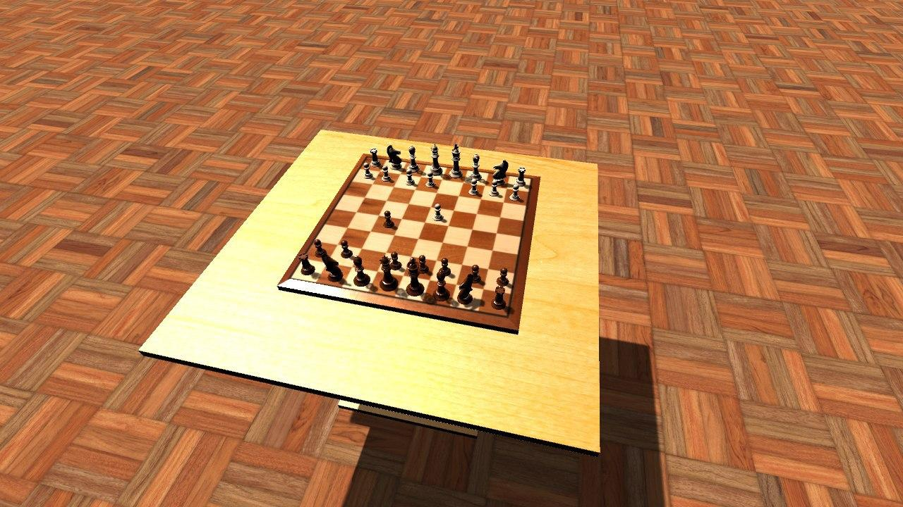
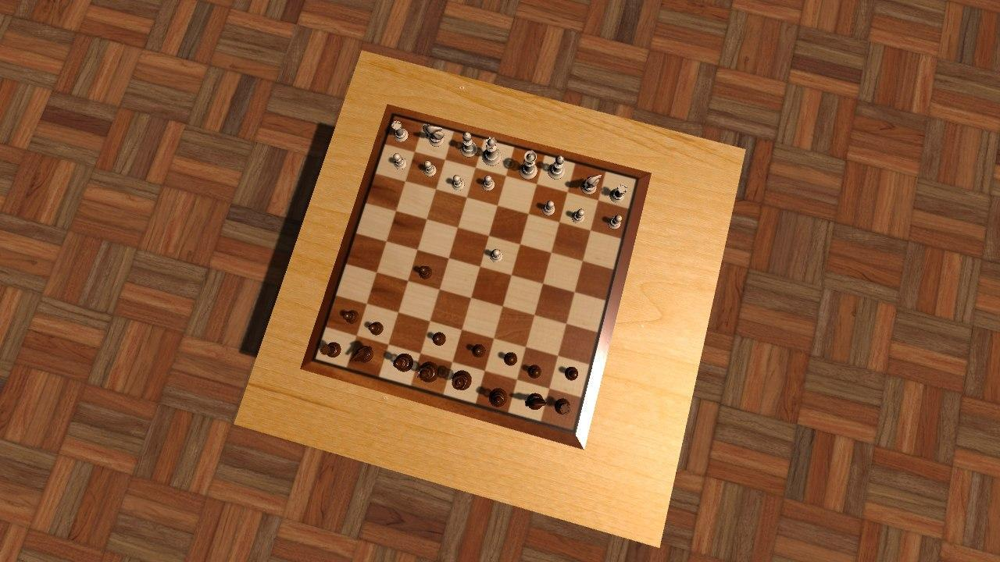

# Chess Dataset Generator

### Installing

1. Install Unity3d >=2019.3.0f3
2. Clone project
3. Open project in Unity

### Using

1. Build project (File -> Build Settings -> Select your platform)
2. Move config files (Fen.data, Interval.json) and textures to build project.
3. Run executable file.

### Configs

The file [Fen.data](Fen.data) contains the positions of the chess pieces (one per line) in the format [FEN](https://en.wikipedia.org/wiki/Forsyth%E2%80%93Edwards_Notation).

The file [Interval.json](Interval.json) contains generation parameters. Values ​​are randomly selected from the interval. Angles in degrees, dimensions in centimeters relative to each other.

Parameters:

* boardPositionX, boardPositionY: chess board position
* cameraRadius, cameraPhi, cameraTheta: camera position in polar coordinates
* spotLightNumber: number of spotlights
* spotLightPositionX, spotLightPositionY, spotLightPositionZ: spotlights position
* spotLightBrightness: spotlights brightness
* ambientLightBrightness: general light brightness
* ambientLightPhi: general light position
* chessBoardWidth: chess board width
* chessmanOffset: displacement of figures relative to the center of the cell
* screenshotPerFen: number of screenshots for one FEN
* screenshotWidth, screenshotHeight: screenshot size in pixels
* pathToTableTexture: path to table texture
* pathToFloorTexture: path to floor texture

Example:
```json
{
    "boardPositionX": {
        "start": -10,
        "end": 10
    },
    "boardPositionY": {
        "start": -10,
        "end": 10
    },
    "cameraRadius": {
        "start": 86,
        "end": 86
    },
    "cameraPhi": {
        "start": 10,
        "end": 20
    },
    "cameraTheta": {
        "start": 30,
        "end": 180
    },
    "spotLightNumber": {
        "start": 0,
        "end": 0
    },
    "spotLightPositionX": {
        "start": -30,
        "end": 10
    },
    "spotLightPositionY": {
        "start": -30,
        "end": 10
    },
    "spotLightPositionZ": {
        "start": 20,
        "end": 20
    },
    "spotLightBrightness": {
        "start": 10,
        "end": 10
    },
    "ambientLightBrightness": {
        "start": 0.8,
        "end": 2
    },
    "ambientLightPhi": {
        "start": 1,
        "end": 360
    },
    "chessBoardWidth": {
        "start": 42,
        "end": 50
    },
    "chessmanOffset": {
        "start": 0,
        "end": 1
    },
    "screenshotPerFen": 10,
    "screenshotWidth": 1280,
    "screenshotHeight": 720,
    "pathToTableTexture": "Assets/Resources/Materials/Textures/table1.jpg",
    "pathToFloorTexture": "Assets/Resources/Materials/Textures/floor1.jpg"
}
```

### Sample generated images




